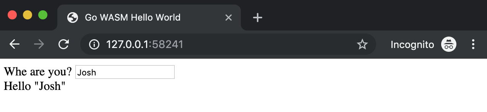

# `gorunwasm` -- An HTTP Server Wrapper For Go

## Demo

[`hello/index.html`](hello/index.html):

```html
<!doctype html>

<title>Go WASM Hello World</title>

<body>

	<div>
		<label for="who">Whe are you?</label>
		<input id="who" type="text" size="20">
	</div>

	<div id="output">...</div>

	<script src="wasm_exec.js"></script>
	<script src="index.js" data-input="#who" data-output="#output"></script>

</body>
```

[`hello/main.go`](hello/main.go):

```golang
// +build js

package main

import (
	"fmt"
	"os"
	"syscall/js"
)

var document = js.Global().Get("document")

func main() {
	input := document.Call("querySelector", os.Getenv("input"))
	output := document.Call("querySelector", os.Getenv("output"))
	input.Call("addEventListener", "change", js.FuncOf(func(this js.Value, args []js.Value) interface{} {
		val := input.Get("value")
		output.Set("innerText", fmt.Sprintf("Hello %q", val))
		return nil
	}))
	select {}
}
```

Then just `gorunwasm` within the folder containing those two files:

```bash
$ go get github.com/jcorbin/gorunwasm

$ gorunwasm
2019/05/27 19:14:53 Serving http files from "/Users/joshua/gorunwasm/hello"
2019/05/27 19:14:53 listening on http://127.0.0.1:58241
```

Open the browser, and type in the input:



But the real joy comes during development, let's break it:

```diff

diff --git a/main.go b/main.go
index 58886f6..956b143 100644
--- a/hello/main.go
+++ b/hello/main.go
@@ -24,7 +24,7 @@ func main() {
        input.Call("addEventListener", "change", js.FuncOf(func(this js.Value, args []js.Value) interf
                val := input.Get("value")
                output.Set("innerText", fmt.Sprintf("Hello %q", val))
-               return nil
+               // return nil FIXME oops
        }))

        select {}
```


## How

Write some js/wasm-targeting Go code in `package main`:

```golang

// +build wasm js

package main

import (
	"fmt"
	"log"
	"os"
	"syscall/js"
	"time"
)

func main() {
	log.Printf("hello: %q", os.Args) // this goes to the browser console

	// call the classic document.write('...') dom api
	doc := js.Global().Get("document")
	doc.Call("write", fmt.Sprintf("<p>hello %q</p>", os.Args))
}
```

Now you can just run `gorunwasm` within the project directory to host this code
in a local web server.

See the [`syscall/js`][syscall_js] package and the [golang WebAssembly
wiki][golang_wasm_wiki] for more.

### HTML

If you write a `index.html` file into your main package, then `gorunwasm` will
host the package directiory on a root `http.FileServer`; otherwise a default
static `index.html` is provided.

Any custom `index.html`:
- MUST include `<script src="wasm_exec.js"></script>` -- hosted from
  `$GOROOT/misc/wasm/wasm_exec.js`, and is part of the upstream wasm
  runtime.
- SHOULD include `<script src="index.js"></script>` -- is `gorunwasm`'s runtime
  harness, which can be further customized with data attributes:
  - `data-status-selector` provides a selector query for an html element used
    to display build and runtime status; without this, interactive (re)-running
    is not possible, and any build error replaces all body content.
  - `data-args` provides JSON-encoded command line arguments, and causes the
    wasm program to be immediately ran after compilation (disabling any
    interactive run prompting through the status element).
  - `data-argv0` provides an alternate program name to run the Go program as;
    the default is "PACKAGENAME.wasm".
  - `data-href` provides an alternate URL to the `build.json` config endpoint.
  - **any other** data attributes are passed as environment variables to the Go
    program; access them the normal way with `os.Getenv("name")`

## What

The server:

- Provides a `main.wasm` endpoint that automatically builds and caches a built
  WASM binary from an input Go package; cache is invalidated when any of the
  source go files are changed, causing a re-build on next load.
- Provides a `build.log` endpoint exposing the build log; especially useful
  when the build fails.
- Also provides a `build.json` endpoint to see target
  [`build.Package`][golang_build_package] data.

The frontend:

- Provides a simple harness that instantiates the built wasm binary ...
- ... or instead shows you the build log on failure.
- Provides a simple `argv` input box, allowing the target command to be ran as
  many times as makes sense.

The Demo:

- `gorunwasm` itself has a build-flagged `main()` wasm entry point in
  [`wasm_main.go`](wasm_main.go); it is a simple DOM manipulating example.

[golang_build_package]: https://golang.org/pkg/go/build/#Package
[golang_wasm_wiki]: https://github.com/golang/go/wiki/WebAssembly
[syscall_js]: https://golang.org/pkg/syscall/js/
