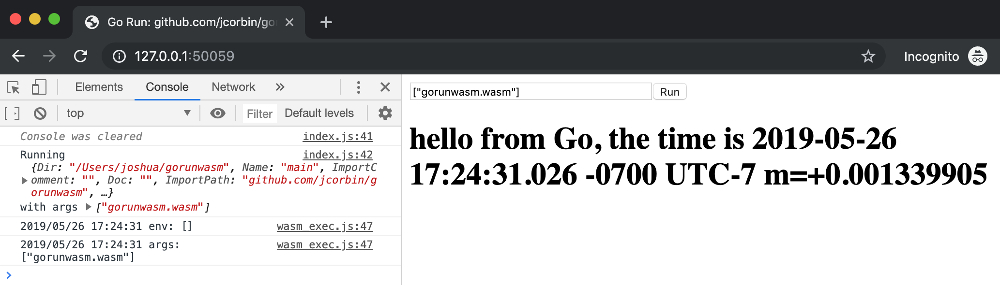

# `gorunwasm` -- An HTTP Server Wrapper For Go

## Demo

```bash

$ go get github.com/jcorbin/gorunwasm

$ gorunwasm github.com/jcorbin/gorunwasm
2019/05/26 17:03:11 listening on http://127.0.0.1:50059
```



## How

1. Write some js/wasm-targeting Go code in `package main`; see
   [`wasm_main.go`](wasm_main.go) for an example. The
   [`syscall/js`][syscall_js] is your friend.
2. Run your code locally using `gorunwasm` from within your project directory,
   or specify the full package name as above.

See the [golang WebAssembly wiki][golang_wasm_wiki] for more.

## What

The server:

- Provides a `main.wasm` endpoint that automatically builds and caches a built
  WASM binary from an input Go package; cache is invalidated when any of the
  source go files are changed, causing a re-build on next load.
- Provides a `build.log` endpoint exposing the build log; especially useful
  when the build fails.
- Also provides a `build.json` endpoint to see target
  [`build.Package`][golang_build_package] data.

The frontend:

- Provides a simple harness that instantiates the built wasm binary ...
- ... or instead shows you the build log on failure.
- Provides a simple `argv` input box, allowing the target command to be ran as
  many times as makes sense.

The Demo:

- `gorunwasm` itself has a build-flagged `main()` wasm entry point in
  [`wasm_main.go`](wasm_main.go); it is a simple DOM manipulating example.

[golang_build_package]: https://golang.org/pkg/go/build/#Package
[golang_wasm_wiki]: https://github.com/golang/go/wiki/WebAssembly
[syscall_js]: https://golang.org/pkg/syscall/js/
